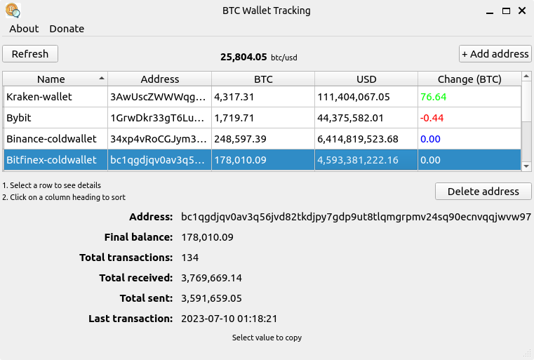

Developer: [Sergey Tsymbal](https://github.com/waplay)
 
 
Email: [waplay@yahoo.com](mailto:waplay@yahoo.com)
 
Telegram: [@waplay](https://t.me/waplay)
 
 
 
# My apps list
 
 
 

###  BTC Wallet Tracking

<u>Tracking bitcoin wallets tool.</u>

Easily track your cryptocurrency wallets or monitor other people's activity with "BTC Wallet Tracker". This convenient app allows you to manage a list of addresses in one place. "BTC Wallet Tracking" also synchronizes wallet data automatically, so you always have up-to-date information.

Key feature:

- Add, edit and delete wallet addresses.
- View wallet information, including balance, transaction history and more.
- Automatic wallet data synchronization.
- Secure storage of wallet information locally on your device.
- Intuitive and user-friendly interface

"BTC Wallet tracking" will save you from the headache of organizing your crypto wallets. No more digging through files and apps to find addresses or balances. Whether you have 2 wallets or 20, "BTC Wallet Tracking" is a simple and safe solution for managing your crypto portfolio. Just open "BTC Wallet Tracking" to instantly access a centralized dashboard for all your wallets. 

For example, the app already has a list of known wallets that you can delete or use to test the app's functionality.

IMPORTANT! The app does not request or store passwords and secret phrases, does not have access to operations with your wallets.
"BTC Wallet Tracking" gives you full control over your data. All data is stored locally on your device, so you can be confident in their privacy and security.

Download it now to easily track all your wallets in one app!

[source code](https://github.com/waplay/btc-wallet-tracking)
 
 
...
 
 
###  Visual Ping

<u>The ultimate tool for monitoring and comparing network performance.</u>

Are you looking for a simple and effective way to monitor the network performance of your websites or servers? Do you want to see how fast and reliable your connections are in real time? If so, you should check out Visual Ping, a desktop application that lets you ping one or two hostnames or IP addresses and see colorful graphs of the results.

Visual Ping is easy to use and intuitive. You just need to enter the hostnames or IP addresses of the sites or servers you want to ping, and click Start. Visual Ping will start sending packets of data to the destinations and measure how long it takes for them to respond. You will see the ping times displayed as lines on a graph, with different colors for each destination. You can also see the minimum, maximum, average and current ping times in milliseconds.

Visual Ping is not only useful for measuring network performance, but also for comparing and troubleshooting. You can ping two destinations at the same time and see how they differ in terms of speed and reliability. You can also zoom in and out of the graph, pause and resume the pinging, and change the interval and size of the packets. If you want to share or save your results, you can take a screenshot of the graph or export the ping data to a file.

Visual Ping is a must-have tool for anyone who cares about network performance and reliability. Try it today and see for yourself how Visual Ping can help you improve your network experience!

