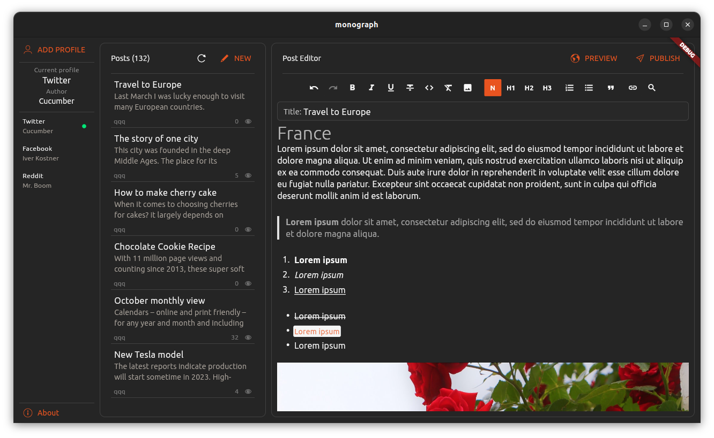

Developer: [Sergey Tsymbal (waplay)](https://github.com/waplay)

  
Contacts

  
  Email: <a href="mailto:waplay@yahoo.com">waplay@yahoo.com</a>
   
  Telegram: <a href="https://t.me/waplay">@waplay</a>  

You can support the developer and projects by making a donation:
 
 

  
Or direct transfer

 
BTC wallet:
 
bc1qtdz2fut4g2hzagjlh6fqnpuz5ghnj8dvjggcd3
 
 
Etherium wallet:
 
0xEb86bf93c6cd4A41cCd1a410Eb1E54d1eaD7D93D
 

 

###  BTC Wallet Tracking

<u>Tracking bitcoin wallets tool.</u>

Easily track your cryptocurrency wallets or monitor other people's activity with "BTC Wallet Tracker". This convenient app allows you to manage a list of addresses in one place. "BTC Wallet Tracking" also synchronizes wallet data automatically, so you always have up-to-date information.

Key feature:

- Add, edit and delete wallet addresses.
- View wallet information, including balance, transaction history and more.
- Automatic wallet data synchronization.
- Secure storage of wallet information locally on your device.
- Intuitive and user-friendly interface

"BTC Wallet tracking" will save you from the headache of organizing your crypto wallets. No more digging through files and apps to find addresses or balances. Whether you have 2 wallets or 20, "BTC Wallet Tracking" is a simple and safe solution for managing your crypto portfolio. Just open "BTC Wallet Tracking" to instantly access a centralized dashboard for all your wallets. 

For example, the app already has a list of known wallets that you can delete or use to test the app's functionality.

IMPORTANT! The app does not request or store passwords and secret phrases, does not have access to operations with your wallets.
"BTC Wallet Tracking" gives you full control over your data. All data is stored locally on your device, so you can be confident in their privacy and security.

Download it now to easily track all your wallets in one app!

[source code](https://github.com/waplay/btc-wallet-tracking)
 
 

 

###  Visual Ping

<u>The ultimate tool for monitoring and comparing network performance.</u>

Are you looking for a simple and effective way to monitor the network performance of your websites or servers? Do you want to see how fast and reliable your connections are in real time? If so, you should check out Visual Ping, a desktop application that lets you ping one or two hostnames or IP addresses and see colorful graphs of the results.

Visual Ping is easy to use and intuitive. You just need to enter the hostnames or IP addresses of the sites or servers you want to ping, and click Start. Visual Ping will start sending packets of data to the destinations and measure how long it takes for them to respond. You will see the ping times displayed as lines on a graph, with different colors for each destination. You can also see the minimum, maximum, average and current ping times in milliseconds.

Visual Ping is not only useful for measuring network performance, but also for comparing and troubleshooting. You can ping two destinations at the same time and see how they differ in terms of speed and reliability. You can also zoom in and out of the graph, pause and resume the pinging, and change the interval and size of the packets. If you want to share or save your results, you can take a screenshot of the graph or export the ping data to a file.

Visual Ping is a must-have tool for anyone who cares about network performance and reliability. Try it today and see for yourself how Visual Ping can help you improve your network experience!

 
 

 

###  Monograph

<u>A powerful tool for creating articles and posts on social networks.</u>

Monograph is a versatile text editor designed for creating beautifully formatted articles and posts on any social networks. Whether you’re a blogger, group manager, or simply enjoy writing, Monograph makes it easy to create professional-looking content. It allows you to publish articles instantly on platforms like Telegram and Facebook without loading delays. With features like anonymous authorship, customizable formatting, and the ability to insert images, Monograph is an ideal tool for expressing your thoughts and sharing longreads. Additionally, Monograph can be used as a notepad for taking notes or for creating a website or product/service presentation page.

  
What is it?

  
Monograph is a simple and powerful text editor for creating articles and posts on social networks. It will help you write formatted articles or messages and publish them on any social network or messenger. If you publish such an article on Telegram or Facebook, it will open instantly without loading from the network. In other social networks, the link to the article in a post or message will be displayed as a beautiful card. The article size is unlimited, making Monograph ideal for writing longreads.
  

  
For whom?

  
First and foremost, this application is designed for beautifully and conveniently formatting articles. Text formatted in Monograph is much easier to read and understand. Therefore, it will be useful for bloggers, those who manage groups and channels on social networks, as well as regular users who enjoy writing articles, sharing travel experiences, and expressing their thoughts.

With Monograph, you can easily create a business card website or presentation page for your product or service. And finally, you can use Monograph as a regular notepad, sharing your notes with anyone.
  

  
How to use it?

  
All your articles are in one place. On the main screen, all articles are displayed in a unified list. You can create multiple profiles for different social networks. Creating new articles is straightforward in the text editor. All articles are created anonymously; you choose the author’s name. After saving an article, you get a direct link to share anywhere. Articles are automatically saved when you exit the editor. You can start writing an article and continue editing it from another device. Edit or delete previously published articles. You can update the cover image, author’s name, text format, and add images. The list of articles shows the total number of views across all social networks. Detailed statistics by day are also available for any month.

Text Formatting: Choose font styles: bold, italic, underline, strikethrough. Adjust font size. Insert lists, quotes, links, images, and more.

Use Monograph to make your messages look like professional articles! With Monograph, you can format text and write in various styles. You can also insert images anywhere in your article and as many as you’d like.
  

 

